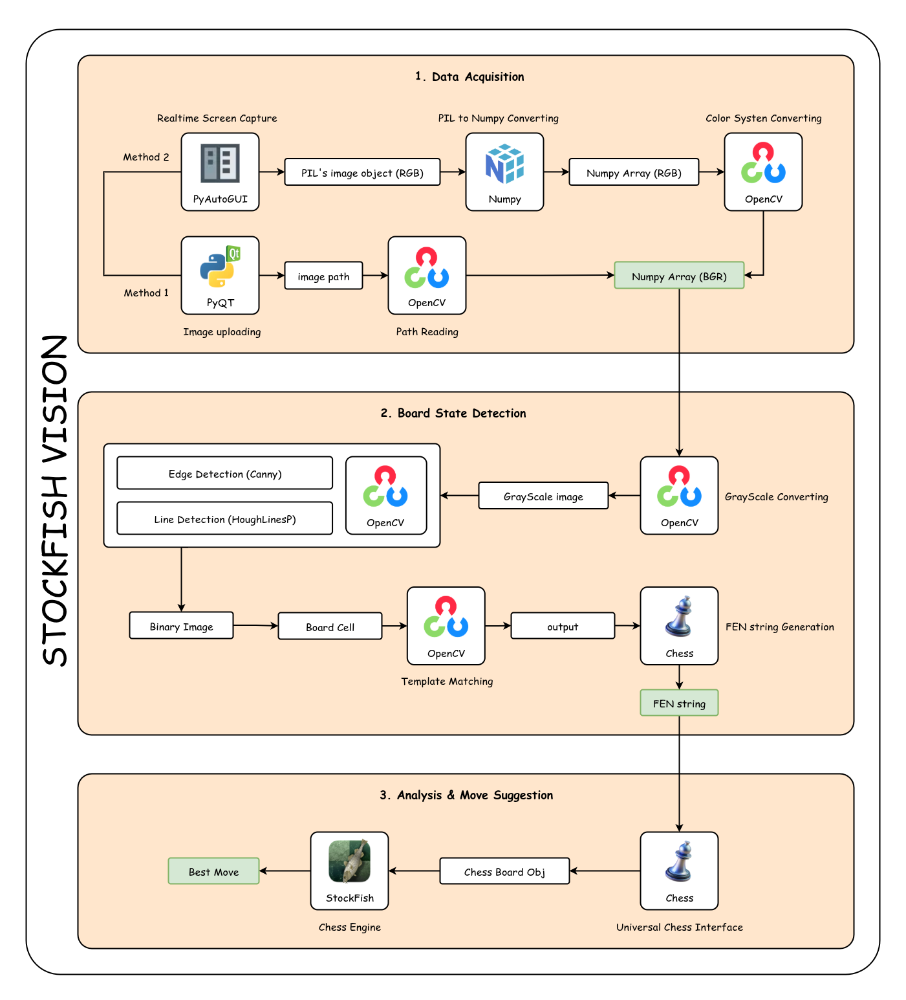

<div align="center">
  
</div>
<hr/>

A Python-based tool that can "look" at your chess game (via screenshot or image upload) and suggest the next optimal move using the Stockfish engine.

--- 

## Features

* **Analysis from Image**: Upload a screenshot of a chess game for analysis.
* **Real-time Analysis**: Capture a region of your screen to get an immediate move suggestion.
* **Automatic Board Detection**: Automatically identifies the board's position and its squares from the image.
* **Piece Recognition**: Distinguishes between all 12 piece types (6 White, 6 Black) on the board.
* **Powerful Engine Integration**: Leverages the strength of Stockfish to find the best possible move.

---

## Architecture & Workflow

The program is built on a 3-module architecture, with each module performing a specific task.

<div align="center">
  
</div>

### **Module 1: Data Acquisition**

The goal is to capture the chessboard image and convert it into a standard format for analysis.
* **Method 1 (Image Upload)**: A **PyQt** interface allows the user to select an image file. **OpenCV** then reads the file path and converts the image into a NumPy array (BGR).
* **Method 2 (Screen Capture)**: **PyAutoGUI** captures the screen (as a PIL image, RGB color system). **NumPy** converts the PIL image to an array, and **OpenCV** converts the color system to BGR.
* **Output**: Both methods yield a **NumPy array with the BGR color system**.

### **Module 2: Board State Detection**

The goal is to convert the image into a FEN string that describes the position.
1.  **Grayscale Conversion**: OpenCV is used to simplify the image.
2.  **Edge & Line Detection**: Uses OpenCV's Canny and HoughLinesP algorithms to identify the board's grid.
3.  **Square Identification**: Based on the detected lines, the program calculates and crops out the images of the 64 individual squares.
4.  **Piece Recognition**: Uses OpenCV's `Template Matching` technique to compare each square's image against 12 pre-saved template images of the chess pieces.
5.  **FEN String Generation**: From the identified piece positions, the program generates a FEN string describing the entire board state.
* **Output**: A **FEN string**.

### **Module 3: Analysis & Move Suggestion**

The goal is to use a chess engine to find the best move from the FEN string.
1.  **Engine Communication**: The **python-chess** library acts as a bridge to initialize and communicate with the **Stockfish** engine.
2.  **Position Setup**: The FEN string from Module 2 is loaded so Stockfish can understand the current position.
3.  **Analysis**: A command is sent to Stockfish, instructing it to analyze the position for a specific amount of time or to a certain depth.
* **Output**: The **best move as a string** (e.g., `e2e4`).

---

## Installation

To run this project on your machine, follow these steps:

**1. Download the Stockfish Engine**

* Download the appropriate Stockfish version for your OS from the official website: [stockfishchess.org](https://stockfishchess.org/download/).
* Extract the archive and place the executable file (e.g., `stockfish.exe`) in the project's root directory.

**2. Clone the Repository**

```bash
git clone https://github.com/DOM-Technology/stockfish-vision
cd stockfish-vision
```

**3. Create a Virtual Environment and Install Dependencies**

```bash
# Create a virtual environment
python -m venv venv

# Activate the virtual environment
# For Windows
venv\Scripts\activate

# For macOS/Linux
source venv/bin/activate

# Install the required packages
pip install -r requirements.txt
```

List of required packages
```bash
opencv-python
numpy
PyAutoGUI
PyQt6
python-chess
mss
```

**5. Usage** updating...

## License
This project is licensed under the MIT License. See the LICENSE file for more details.